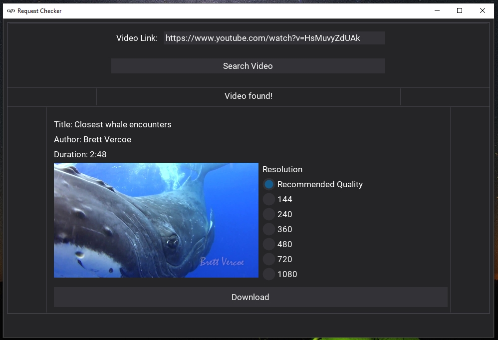

# yt-dlp-gui
A very small and simple dearpy GUI for downloading videos from youtube using yt-dlp.

## Instruction
- Install requirements `pip install -r requirements.txt`
- Run `main.py`
- Insert the url link for the youtube video.
- You may select your prefered video quality to download, `Recommended Quality` will download the best video format based on yt-dlp standards.

### Example
